# 10 OOP: Team Profile Generator

    

## Description

Node CLI application that takes in information about employees and generates an HTML webpage that displays summaries for each person.

## Snapshot


## TableOfContents

* [Description](#Description)
* [Snapshot](#Snapshot)
* [TableOfContents](#TableOfContents)
* [UserStory](#UserStory)
* [AcceptanceChecklist](#AcceptanceChecklist)
    * [InitialRequirements](#InitialRequirements)
    * [ApplicationRequirements](#ApplicationRequirements)
    * [SubmissionRequirements](#SubmissionRequirements)
* [AppUsage](#AppUsage)
    * [Installation](#Installation)
    * [Configuration](#Configuration)
    * [Operation](#Operation)
    * [Output](#Output)
    * [Bonus](#Bonus)
* [Features](#Features)
* [VideoWalkthrough](#VideoWalkthrough)

## UserStory

AS A manager

I WANT to generate a webpage that displays my team's basic info

SO THAT I have quick access to emails and GitHub profiles

## AcceptanceChecklist

### InitialRequirements

You will build a software engineering team generator command line application. 

The application will prompt the user for information about the team manager and then information about the team members.

The user can input any number of team members, and they may be a mix of engineers and interns. 

- `Product Owner`, `Scrum Master`, `Tech Lead`, `QA` categories were added. Issac.

This assignment must also pass all unit tests.

- All js files were unit tested with the exception of `app.js`. Mocking inquirer input using JEST turned out to be very difficult to achieve. Issac

When the user has completed building the team, the application will create an HTML file that displays a nicely formatted team roster based on the information provided by the user. 

- Final HTML page is built using `Materialize`, includes `Fontawesome` linkage, CSS styling, also includes a sticky footer and nav bar. Issac.

### ApplicationRequirements

The project must have these classes: `Employee`, `Manager`, `Engineer`, `Intern`. The tests for these classes in the `tests` directory must all pass.

- App includes the mentioned classes along with `Product Owner`, `Scrum Master`, `Tech Lead` and `QA`. Issac.

Classes inherited from `Employee` parent class will have the following properties and methods: `name`, `id`, `email`, `position`, `getName()`, `getId()`, `getEmail()`, `getPosition()` 

- Depending on the type of class defined it will have the attributes mentioned above. `Intern`, `QA` and `Engineer` classes will have an additional attribute called `recursive` in order to control recursive capture. Issac.

- App includes the mentioned classes along with `Product Owner`, `Scrum Master`, `Tech Lead` and `QA`. Issac.

The project must prompt the user to build an engineering team. An engineering team consists of a manager, and any number of engineers and interns.

- As mentioned before we also included elements for `Product Owner`, `Scrum Master`, `Tech Lead` and `QA` positions. Issac.

### SubmissionRequirements

Use the `Inquirer` to prompt the user for their `email`, `id`, and specific `attribute` based on role. 

- Done. Issac

Your app will run as a Node CLI to gather information about each employee.

- Done. Issac

Remember, the styling is completely up to you so try to make it unique.

- Done. Issac

In the `Develop` folder, there is a `package.json`, so make sure to `npm install`.

- `package.json` and `app.js` are located in `root` folder. Issac

Dependencies for this endeavor are `JEST` for running unit tests, and `Inquirer` for collecting input from the user.

- `JEST` is listed as a Dev Dependency. Issac

There are also unit tests to help you build the classes necessary. It is recommended that you follow this workflow: 1. Run tests. 2. Create or update classes to pass a single test case. 3. Repeat

- Done. Issac

Directory structure is the following:

```
assets/ .................... CSS styling.
    style.css
 
helper/ .................... Classes to render HTML document.
    builder.js ............. Orchestrates the HTML build operation   
    writer.js .............. File interfacing methods

lib/ ....................... Team member classes, all inherit from employee.js
    employee.js ............ Base class for all team member elements.
    engineer.js ............ Particular element attribute is GitHub.
    intern.js .............. Particular element attribute is School.
    manager.js ............. Particular element attribute is Organization.
    productowner.js ........ Particular element attribute is Cost Center.
    qa.js .................. Particular element attribute is Phase.
    scrummaster.js ......... Particular element attribute is Project Code.
    techlead.js ............ Particular element attribute is Area.

output/ .................... Rendered output
    team.html .............. Solution's output file.
    team_jest.html ......... Output file for jest to write to separate output file.
    team_locked.html ....... Output file for jest to try write to a locked file.

templates/ ................. HTML template(s). Team member elements will be appended between Main1 and Main2 content.
    endDiv.html ............ Has a </div> tag in order to finalize a row element.
    engineer.html .......... Engineer element template.
    intern.html ............ Intern element template.
    main1.html ............. Main HTML content. It includes HEAD, and upper BODY area, and Project Name to be replaced. 
    main2.html ............. Ending Main HTML content. Includes FOOTER, JQUERY linakge and sticky element script code. 
    manager.html ........... Manager element template.
    productowner.html ...... Productowner element template.
    qa.html ................ QA element template.
    sample.html ............ Finalized HTML sample to validate against output/team.hml.
    scrummaster.html ....... Scrummaster element template.
    sqRow.html ............. Tag to identify a row element.
    techlead.html .......... Productowner element template.

test/ ...................... JEST Unit tests
    builder.test.js
    employee.test.js
    engineer.test.js
    intern.test.js 
    manager.test.js 
    productowner.test.js 
    qa.test.js 
    scrummaster.test.js 
    techlead.test.js 
    writer.test.js 

app.js ..................... Runs the application and captures input using inquirer
```
## AppUsage

### Installation 

*Step 1.* Clone repo into your localhost.

*Step 2.* Open Terminal and run "npm i --save" in order to install dependencies.

*Step 3.* Write "node app.js" in Terminal.

### Configuration 

No configuration is needed.

### Operation 

*Step 1.* Go to Terminal and `node app.js`.

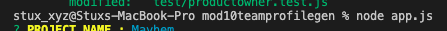

*Step 2.* Input `Project Name`.

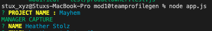

*Step 3.* Input requested team member's `name`, `email` and team member's `target attribute`. 

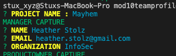

*Step 4.* Input information for `Manager`, `Product Owner`, `Scrum Master` and `Tech Lead`. You're only allowed to submit one of these elements. 

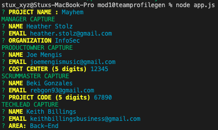

*Step 5.* Input `Engineer`, `QA` and `Intern` team members. Since it's a recursive element capture you can input as many team members needed.

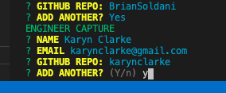

*Step 6.* Terminal will display a list of all the appended elements.

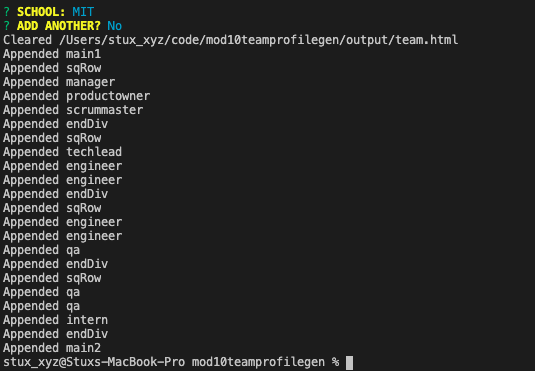

### Output 

* Output File will be written in the following link [team.html](https://github.com/carlosissac/mod10teamprofilegen/blob/master/output/team.html)

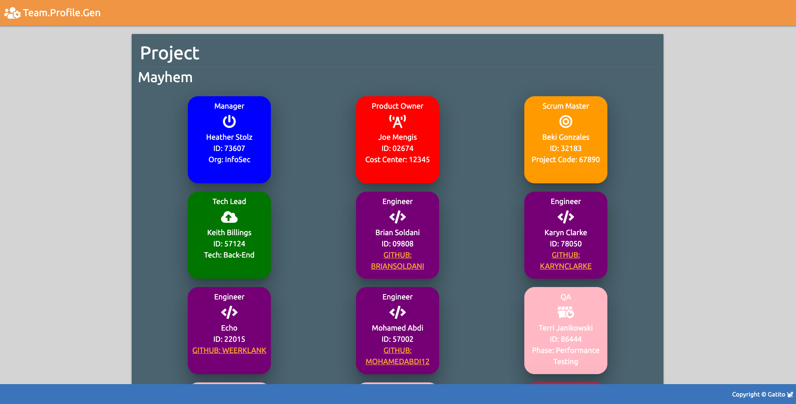

### Bonus

Use validation to ensure that the information provided is in the proper expected format.

- List input is provided in `Manager`, `Tech Lead`, `QA`.

- 5 digit numeric input is required for `Scrum Master` and `Product Owner`.

- Rest of inputs requires mandatory text input if test is not provided it will thorw an error.

- Issac.

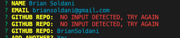

Add the application to your portfolio.

- `mod10teamprofilegen` is added to portfolio in the following [link](https://carlosissac.github.io/mod08hwprofessionalmaterials/).

## Features

* *Recursive Capture.* `Engineer`, `QA` and `Intern`, are allowed to capture as many elements as required.


* *GitHub links.* Engineering elements have working GitHub links.

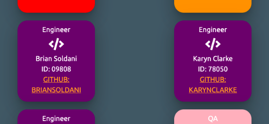

* *Testing using JEST.* All files with the exception of `app.js` are unit tested using Jest. `app.js` includes the user input capture functionality using inquierer which resulted difficult to mock using JEST. Shown below are the snapshots of the testing coverage implemented.

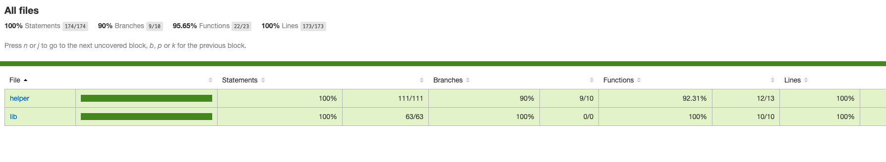

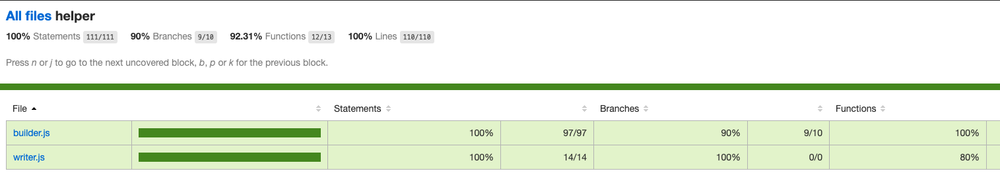

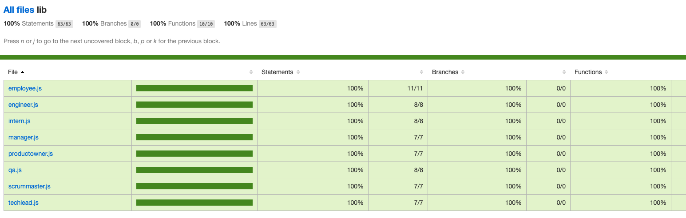

## VideoWalkthrough

The following links provide video walkthroughs explaining the development decisions made for this project and a walkthrough of the usage of the app. Also provided is a slide deck for the explanation video

* [Video Intro](https://youtu.be/RzNnGMWdHG8)

* [Slides](https://docs.google.com/presentation/d/1u0N-WSlIxcli8ZZkuJ8BqCimpyQfpO8YdvkVslMIwvc/edit?usp=sharing)

* [Video Demo](https://youtu.be/jxbjp4-x-zY)

