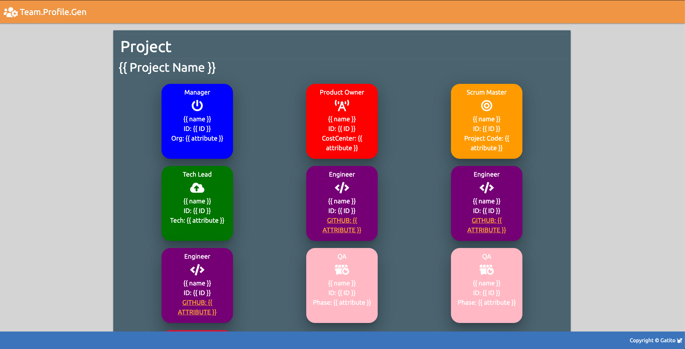

# 10 OOP: Team Profile Generator
    

## Description

Target is creating a command line application that dynamically generates a professional README.md from a user's input using Inquirer NPM package, also using a privided documentation as a guideline as to what content does a quality document should have.

## Snapshot



## TableOfContents

* [Description](#Description)
* [Snapshot](#Snapshot)
* [TableOfContents](#TableOfContents)
* [UserStory](#UserStory)
* [AcceptanceChecklist](#AcceptanceChecklist)
    * [InitialRequirements](#InitialRequirements)
    * [ApplicationRequirements](#ApplicationRequirements)
    * [SubmissionRequierements](#SubmissionRequierements)
* [AppUsage](#AppUsage)
    * [Instalattion](#Instalattion)
    * [Configuration](#Configuration)
    * [Operation](#Operation)
    * [Output](#Output)
* [Features](#Features)
* [VideoWalkthrough](#VideoWalkthrough)

## UserStory

AS A manager

I WANT to generate a webpage that displays my team's basic info

SO THAT I have quick access to emails and GitHub profiles

## AcceptanceChecklist

### InitialRequirements

You will build a software engineering team generator command line application. 

The application will prompt the user for information about the team manager and then information about the team members.

The user can input any number of team members, and they may be a mix of engineers and interns. 

- `Product Owner`, `Scrum Master`, `Tech Lead`, `QA` categories were added. Issac.

This assignment must also pass all unit tests.

- All js files were unit tested with the exception of `app.js`. Mocking inquirer input using JEST resulted very difficult. Issac

When the user has completed building the team, the application will create an HTML file that displays a nicely formatted team roster based on the information provided by the user. 

- Final HTML page is built using `Materialize`, includes `Fontawesome` linkage, CSS styling, also include a sticky footer and nav bar. Issac.

### ApplicationRequirements

### SubmissionRequierements

Use the `Inquirer` to prompt the user for their `email`, `id`, and specific `attribute` based on role. 

- Done. Issac

Your app will run as a Node CLI to gather information about each employee.

- Done. Issac

Remember, the styling is completely up to you so try to make it unique.

- Done. Issac

In the `Develop` folder, there is a `package.json`, so make sure to `npm install`.

- `package.json` and `app.js` are located in `root` folder. Issac

Dependencies for this endeavor are `JEST` for running unit tests, and `Inquirer` for collecting input from the user.

- `JEST` is listed as a Dev Dependency. Issac

There are also unit tests to help you build the classes necessary. It is recommended that you follow this workflow: 1. Run tests. 2. Create or update classes to pass a single test case. 3. Repeat

- Done. Issac

Directory structure is the following:

```
assets/ .................... CSS styling.
    style.css
 
helper/ .................... Classes to render HTML document.
    builder.js ............. Orchestrates the HTML build operation   
    writer.js .............. File interfacing methods

lib/ ....................... Team member classes, all inherit from employee.js
    employee.js ............ Base class for all team member elements.
    engineer.js ............ Engineer element class, particular element attribute is GitHub.
    intern.js .............. Intern element class, particular element attribute is School.
    manager.js ............. Manager element class, particular element attribute is Organization.
    productowner.js ........ Product Owner element class, particular element attribute is Cost Center.
    qa.js .................. QA element class, particular element attribute is Phase.
    scrummaster.js ......... Scrum Master element class, particular element attribute is Project Code.
    techlead.js ............ Tech Lead element class, particular element attribute is Area.

output/ .................... Rendered output
    team.html .............. Solution's output file.
    team_jest.html ......... Output file for jest to write to separate output file.
    team_locked.html ....... Output file for jest to try write to a locked file.

templates/ ................. HTML template(s). Team member elements will be appended between Main1 and Main2 content.
    endDiv.html ............ Has a </div> tag in order to finalize a row element.
    engineer.html .......... Engineer element template.
    intern.html ............ Intern element template.
    main1.html ............. Main HTML content. It includes HEAD, and upper BODY area, and Project Name to be replaced. 
    main2.html ............. Ending Main HTML content. Includes FOOTER, JQUERY linakge and sticky element script code. 
    manager.html ........... Manager element template.
    productowner.html ...... Productowner element template.
    qa.html ................ QA element template.
    sample.html ............ Finalized HTML sample to validate against output/team.hml.
    scrummaster.html ....... Scrummaster element template.
    sqRow.html ............. Tag to identify a row element.
    techlead.html .......... Productowner element template.

test/ ...................... JEST Unit tests
    builder.test.js ........ 
    employee.test.js ....... 
    engineer.test.js ....... 
    intern.test.js ......... 
    manager.test.js ........ 
    productowner.test.js ... 
    qa.test.js ............. 
    scrummaster.test.js .... 
    techlead.test.js ....... 
    writer.test.js ......... 

app.js ..................... Runs the application
```
## AppUsage

### Instalattion 

*Step 1.* Clone repo into your localhost.

*Step 2.* Open Terminal and run "npm i --save" in order to install dependencies.

*Step 3.* Write "node app.js"

*Step 4.* Set "select_mode" to either true or false depending on the mode you want to run.

### Configuration 

*Step 1.* Open Index.js file.

*Step 2.* Make sure that the following flag is set to True.


### Operation 

*Step 1.* Go to Terminal and run index.js.


*Step 2.* ProjectID and InputType will be shown.


*Step 3.* Submit input as required and press enter as prompted. When a caption is shown "Press <enter> to launch your preferred editor". Press enter so that VIM editor is shown.


*Step 4.* VIM editor will be shown.


*Step 5.* Press "i" and the "INSERT" caption will be shown below


*Step 6.* Write text content. After you are done press "ESC" key and ":wq!" 


### Output 

* When running on Fixed mode we output to [README_GENFIX.md](https://github.com/carlosissac/mod09hwreadmegen/blob/master/README_GENFIX.md)

* While running on User mode we output to [README_GENUSER.md](https://github.com/carlosissac/mod09hwreadmegen/blob/master/README_GENUSER.md)

## Features

* *Editor capture.* When some of the README sections require large amounts of texts user is taken to VIM editor for a better text capture.


* *List option.* When prompted for license type we are asked to select from a list of options.


* *Recursive capture.* After static input is captured the user will be propmpted for several items in a recursive manner. By this we mean that the user will be prompted for items until the user decides to move on.


* *Fixed Input Mode.*. This mode was developed in order to do an integration test beween the ReadMe, Writer and Fixed moduled, and also in order to test the markdown document fornat.

* *Jest Unit testing.* ReadMe, Writer and License proto were unit tested using JEST. These tests are coded the the files ending in ".test.js". Unit test results are stored in "coverage/lcov-report/index.html" file, currently not tracked using GitHub.


## VideoWalkthorugh

The following links provide a video walkkthoroughs explaining the development desicions made for this project and a walkthorugh of the usage of the app. Also provided is a slide deck for the explanation video

* [Video Intro](https://youtu.be/RzNnGMWdHG8)

* [Slides](https://docs.google.com/presentation/d/1u0N-WSlIxcli8ZZkuJ8BqCimpyQfpO8YdvkVslMIwvc/edit?usp=sharing)

* [Video Demo](https://youtu.be/jxbjp4-x-zY)

